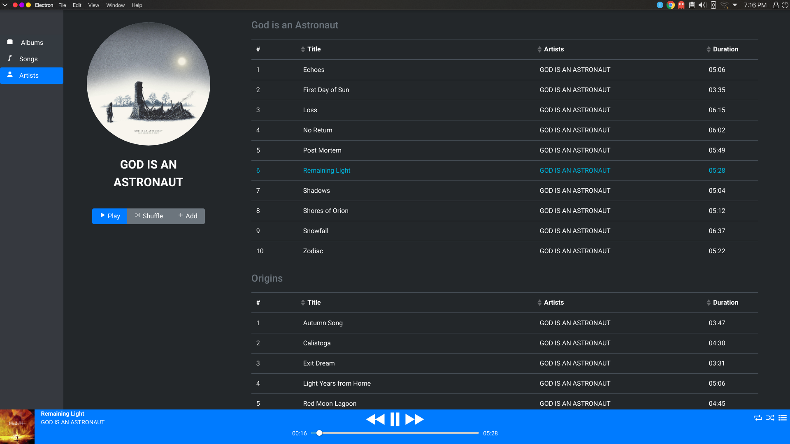

# music-player

An Electron app to play your music files

<p align="center">
  
</p>

## Project setup

Install the requirements

```
yarn install
```

## To run

```
yarn electron:serve
```

## To build

```
yarn electron:build
```

## Library configuration
```
In src/main/config.json
  Add the folders to scan in LIBRARY_FOLDERS
  Also add our Spotify API_KEY and API_SECRET for downloading artist images
```
